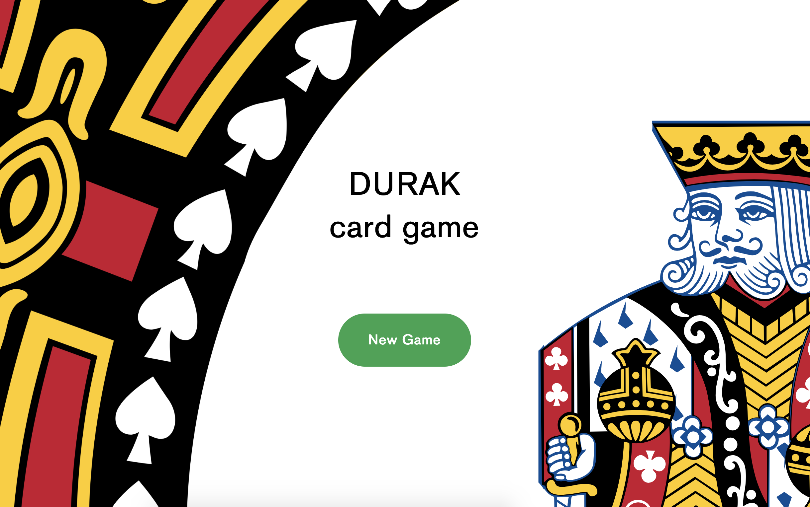
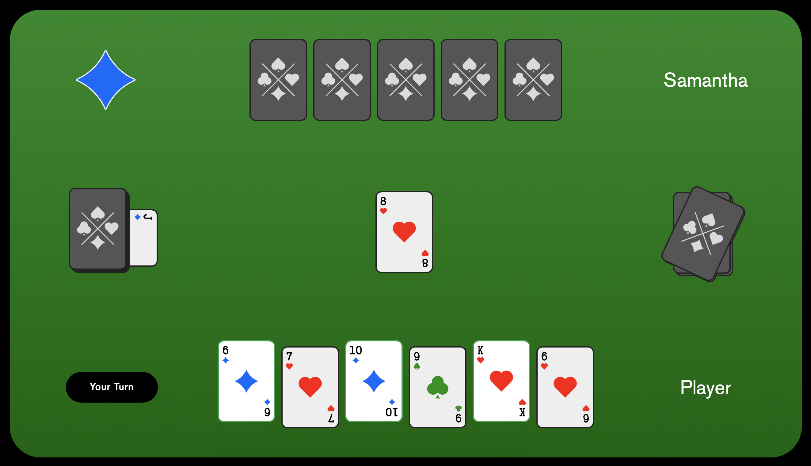

«Durak» or «Fool» is a card game that is popular in many states.  The objective of the game is to shed all one's cards when there are no more cards left in the deck. At the end of the game, the last player with cards in their hand is the «durak or «fool».

